# Rails Girl 2019

<details><summary><h2>0. Prepare your development environbment</h2></summary>

Before you get start, please make sure your laptop is ready for the workshop. Typically, you'll need those applications:

- Text editor (heavily personal preference, for example VSCode, Atom, etc.)
- Web Browser (Chrome, Safari, Firefox, etc.)
- Terminal
- Docker
- Git

</details>

<details><summary><h2>1. Getting Started</h2></summary>

To make things easier for you to setup the development environment, we already prepare a developmet kit, and all the following commands are based on this template. If you want to setup the development environment by yourself from scratch, read the Go Extra Miles sections. You'll need to make a copy of this kit in your computer,

- Open the terminal in your computer
- Run this command in your terminal:

```bash
git clone git@github.com:nguyenquangminh0711/rails-girl-demo.git
```

- Change the working directory to the kit:

```bash
cd rails-girl-demo
```

- Start the web server with this command:

+ On Windows

```bash
./start_server.bat
```

+ On Linux/MacOS

```bash
./start_server.sh
```

- The web server is started at [http://localhost:4000](http://localhost:4000). Open this link, and if you can see this, congratulation, you started your first web server.

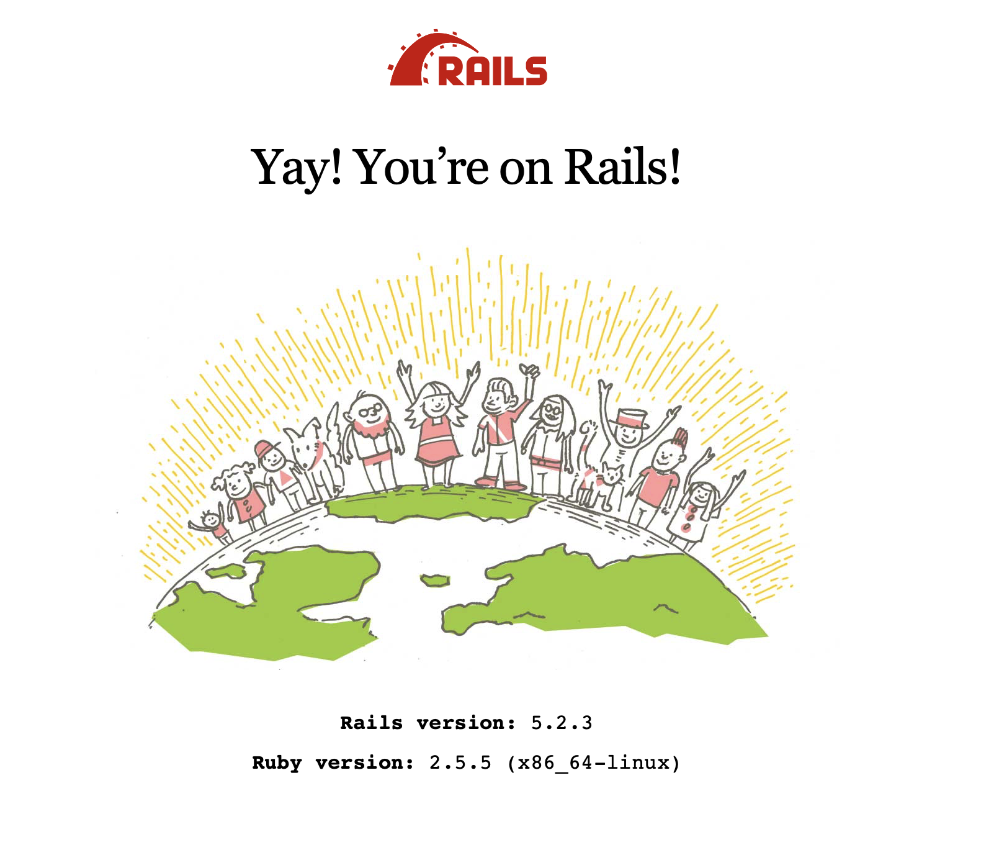

- To stop the web server, in your recent terminal window, press `Ctrl` and `C`.
</details>

<details><summary><h2>2. Create a static product listing page</h2></summary>

In this section, you'll be able to create a page to show a list of products. A typical product shown on the home page needs some information:

- Name, for example "iPhone XS Max 64GB"
- Brand, for example "Apple"
- Price, for example, "29,000,000"
- Product image, for example: [iPhone XS Max image from FPT Shop](https://cdn.fptshop.com.vn/Uploads/Originals/2018/10/11/636748771945393060_iPhone-Xs-Max-gold.png)

Let's create the first page to show the above product.

- Start another terminal window
- Run this command

+ On Windows

```bash
./start_console.bat
```

+ On Linux/MacOS

```bash
./start_console.sh
```

- Run this command:

```bash
rails generate controller Products index show
```

You are using the scaffolding feature of Rails. If everything is correct, you'll see something like this:

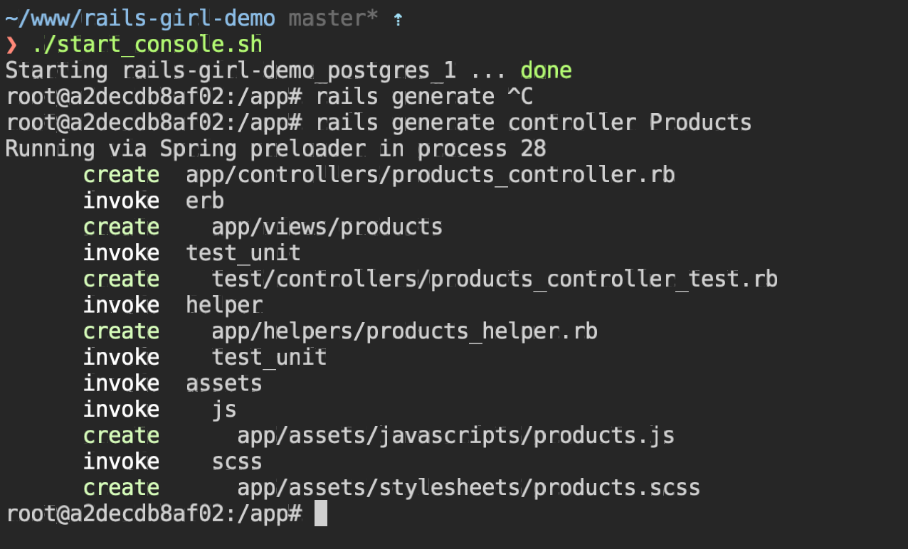

- Now, open the file `app/controllers/products_controller.rb`, you'll see something like this:

```ruby
class ProductsController < ApplicationController
  def index
  end
end
```

- Let's add the list of products you want to display to the `index` method of class `ProductsController`. You can add as many products you want. You can copy the image links from Google Images:

```ruby
class ProductsController < ApplicationController
  def index
    @products = [
      {
        name: 'Điện thoại iPhone XS Max 512GB',
        brand: 'Apple',
        price: 29000000,
        image: 'https://cdn.fptshop.com.vn/Uploads/Originals/2018/10/11/636748771945393060_iPhone-Xs-Max-gold.png'
      },
      {
        name: 'Tai nghe Bluetooth Airpod 2',
        brand: 'Apple',
        price: 4500000,
        image: 'https://store.storeimages.cdn-apple.com/4982/as-images.apple.com/is/image/AppleInc/aos/published/images/M/RX/MRXJ2/MRXJ2?wid=1144&hei=1144&fmt=jpeg&qlt=95&op_usm=0.5,0.5&.v=1551489675083'
      },
      {
        name: 'Điện Thoại Samsung Galaxy S10',
        brand: 'Samsung',
        price: 16000000,
        image: 'https://cdn.fptshop.com.vn/Uploads/Originals/2019/2/21/636863643187455627_ss-galaxy-s10-trang-1.png'
      },
      {
        name: 'Tai nghe Beat Studio M8',
        brand: 'Apple',
        price: 7000000,
        image: 'https://ngheloa.com/wp-content/uploads/2017/12/headphone-beat-studio-ms-81118-chinh-hang-ngheloa.com-1.jpg'
      },
      {
        name: 'Máy tính bảng iPad Pro 11 inch Wifi 64GB',
        brand: 'Apple',
        price: 20000000,
        image: 'https://cdn.tgdd.vn/Products/Images/522/195067/ipad-pro-11-inch-2018-64gb-wifi-33397-thumb-600x600.jpg'
      },
    ]
  end
end
```

Let's add a list of 5 items. Please note that all items in the product list must have 4 fields: `name`, `brand`, `brand`, `price`.

- Edit the file `app/views/products/index.html.erb`. Replace the content with the follow scripts:

```erb
<% @products.each do |product| %>
  <%= render 'product', product: product %>
<% end %>
```

- Create new file `app/views/products/_product.html.erb`, with the following content:

```erb
<div class="product">
  <p>
    "/>
  </p>
  <b><%= product[:name] %></b>
  <p><%= product[:brand] %></p>
  <i><%= number_to_currency(product[:price], unit: 'đ', seperator: ',') %></i>
</div>
```

- To make the product listing page your home page, replace the content in `config/routes.rb` with:

```ruby
Rails.application.routes.draw do
  root 'products#index'
end
```

- Open [http://localhost:4000](http://localhost:4000). Tada, you have your first basic product page.


- It doesn't look great right? Let's add some styling to this page to make it more attractive. We'll use [Bootstrap 4](https://getbootstrap.com), which is the most popular front-end framework. The library is already bundled in the development kit. You'll just need to modify and apply the HTML components into the product page.

- Update the file `app/views/products/index.html.erb` with:

```erb
<div class="products container">
  <div class="row">
    <% @products.each do |product| %>
      <%= render 'product', product: product %>
    <% end %>
  </div>
</div>
```

- Update the file `app/views/products/_product.html.erb` with:

```erb
<div class="product col-md-4 mb-3">
  <p>
    "/>
  </p>
  <div class="product-brand mb-1"><%= product[:brand] %></div>
  <h5 class="product-name"><%= product[:name] %></h5>
  <h5 class="product-price"><%= number_to_currency(product[:price], unit: 'đ', seperator: ',', format: "%n %u") %></h5>
</div>
```

- Update the file `app/assets/stylesheets/products.scss` with:

```css
.product-name {
  color: #222;
}

.product-name a {
  color: #222;
}

.product-brand {
  color: #777;
}

.product-price {
  color: green;
}
```

- Refresh your website, you'll see something like this. Not bad huh?


</details>

<details><summary><h2>3. Use database to manage your products</h2></summary>

When the number of products grows, it's terrible to keep adding the products to the `ProductsController`. Let's use the database to store and manage your products.

- Generate models and schema migration with this command:

```bash
rails generate model Product name:text brand:text price:integer image:text
```

- Make the database schema change take effective with this command:

```bash
rake db:migrate
```

- We'll need some validations for the Product model to ensure the validity of data. Edit the file `app/models/product.rb`

```ruby
class Product < ApplicationRecord
  validates :name, presence: true, length: {in: 5..255}
  validates :brand, presence: true, length: {in: 5..100}
  validates :price, inclusion: 1..1000000000
  validates  :image, presence: true
end
```

- You'll need a list of seed products for your website. Copy the product list in `ProductsController`, and convert into following in the file `db/seeds.rb`

```ruby
Product.destroy_all
Product.create(
  name: 'Điện thoại iPhone XS Max 512GB',
  brand: 'Apple',
  price: 29000000,
  image: 'https://cdn.fptshop.com.vn/Uploads/Originals/2018/10/11/636748771945393060_iPhone-Xs-Max-gold.png'
)
Product.create!(
  name: 'Tai nghe Bluetooth Airpod 2',
  brand: 'Apple',
  price: 4500000,
  image: 'https://store.storeimages.cdn-apple.com/4982/as-images.apple.com/is/image/AppleInc/aos/published/images/M/RX/MRXJ2/MRXJ2?wid=1144&hei=1144&fmt=jpeg&qlt=95&op_usm=0.5,0.5&.v=1551489675083'
)
Product.create!(
  name: 'Điện Thoại Samsung Galaxy S10',
  brand: 'Samsung',
  price: 16000000,
  image: 'https://cdn.fptshop.com.vn/Uploads/Originals/2019/2/21/636863643187455627_ss-galaxy-s10-trang-1.png'
)
Product.create!(
  name: 'Tai nghe Beat Studio M8',
  brand: 'Apple',
  price: 7000000,
  image: 'https://ngheloa.com/wp-content/uploads/2017/12/headphone-beat-studio-ms-81118-chinh-hang-ngheloa.com-1.jpg'
)
Product.create!(
  name: 'Máy tính bảng iPad Pro 11 inch Wifi 64GB',
  brand: 'Apple',
  price: 20000000,
  image: 'https://cdn.tgdd.vn/Products/Images/522/195067/ipad-pro-11-inch-2018-64gb-wifi-33397-thumb-600x600.jpg'
)
```

- Run this script to seed the product list into database:

```ruby
rake db:seed
```

- Update the file `app/controllers/products_controller.rb`, with:

```ruby
class ProductsController < ApplicationController
  def index
    @products = Product.all
  end
end
```

- Replace the hash access syntax to method calls in `app/views/products/_product.html.erb` with:

```ruby
<div class="product col-md-4 mb-3">
  <p>
    "/>
  </p>
  <div class="d-flex justify-content-between">
    <div class="product-brand mb-1"><%= product.brand %></div>
    <div class="product-id mb-1">#<%= product.id %></div>
  </div>
  <h5 class="product-name"><%= product.name %></h5>
  <h5 class="product-price"><%= number_to_currency(product.price, unit: 'đ', seperator: ',', format: "%n %u") %></h5>
</div>
```

- The number next to the brand is the product ID. Add some CSS styles to de-emphasize the product ID. Add to the file `app/assets/stylesheets/products.scss`:

```css
.product-id {
  color: #777;
}
```

- Now, open Rails console with the command:

```bash
rails c
```

- You can freely create a new product by copy & paste the commands into Rails console:

```ruby
Product.create!(
  name: 'name',
  brand: 'brand',
  price: 1000,
  image: 'image_url'
)
```

- You can also update a particular product information (for example ID 4), with the following commands in Rails console:

```ruby
product = Product.find(4)
product.update!(price: 8000000)
```

- And finally, you can delete a particular product (for example ID 3), with the following commands in Rials console:

```ruby
product = Product.find(3)
product.destroy!
```
</details>


<details><summary><h2>4. Build the product detail page</h2></summary>

- Add the routing information of the products to `config/routes.rb`:

```ruby
resources :products, only: [:index, :show]
```

- Create a top navigation bar. Update the file `app/views/layouts/application.html.erb` with:

```erb
<!DOCTYPE html>
<html>
  <head>
    <meta charset="utf-8">
    <meta name="viewport" content="width=device-width">
    <title>Rails Girl Shop</title>
    <%= csrf_meta_tags %>
    <%= csp_meta_tag %>

    <%= stylesheet_link_tag    'application', media: 'all' %>
    <%= javascript_include_tag 'application' %>
  </head>

  <body>
    <nav class="navbar navbar-light bg-light">
      <a class="navbar-brand" href="<%= root_path %>">
        Rails Girl Shop
      </a>
      <ul class="navbar-nav">
        <li class="nav-item active">
          <a class="nav-link" href="<%= root_path %>">Products</a>
        </li>
      </ul>
    </nav>
    <main class="pt-3">
      <%= yield %>
    </main>
  </body>
</html>
```

- To view the list of available routes, use

```bash
rake routes
```

- Add the product link, edit the file `app/views/products/_product.html.erb`:


```erb
<div class="product col-md-4 mb-3">
  <a href="<%= product_path(product) %>">
    <p>
    "/>
    </p>
  </a>
  <div class="d-flex justify-content-between">
    <div class="product-brand mb-1"><%= product.brand %></div>
    <div class="product-id mb-1">#<%= product.id %></div>
  </div>

  <h5 class="product-name"><a href="<%= product_path(product) %>"><%= product.name %></a></h5>
  <h5 class="product-price"><%= number_to_currency(product.price, unit: 'đ', seperator: ',', format: "%n %u") %></h5>
</div>
```

- Add the `show` method into `ProductsController` at `app/controllers/products_controller.rb`

```ruby
  def show
    @product = Product.find(params[:id])
  end
```

- Create the product detail page, edit `app/views/products/show.html.erb`

```ruby
<div class="product-detail container d-flex justify-content-around">
  "/>
  <div class="product-detail-info ml-3">
    <div class="d-flex justify-content-between">
      <div class="product-brand mb-1"><%= @product.brand %></div>
      <div class="product-id mb-1">#<%= @product.id %></div>
    </div>

    <h4 class="product-name"><a href="<%= product_path(@product) %>"><%= @product.name %></a></h5>
    <h5 class="product-price"><%= number_to_currency(@product.price, unit: 'đ', seperator: ',', format: "%n %u") %></h5>
  </div>
</div>
```

- Add some styles into `app/assets/stylesheets/products.scss`:

```css
.product-detail .product-detail-info {
  flex: 0 0 300px;
}
```

- The product detail page needs some more information. Let's add one more field into product, called description.

```bash
rails generate migration add_description_to_products description:text
```

- Run command to make database migration effective:

```bash
rake db:migrate
```

- Add product description for a product (for example, ID 3) with Rails console. Or you can update the seed file and re-seed again.

```ruby
product = Product.find(3)
product.update!(description: "- An immersive Cinematic Infinity Display, Pro-grade Camera and Wireless PowerShare The next generation is here

- Ultrasonic in-display fingerprint ID protects and unlocks with the first touch

- Pro-grade Camera effortlessly captures epic, pro-quality images of the world as you see it

- Intelligently accesses power by learning how and when you use your phone
")
```

- Add product description section to the file `app/views/products/show.html.erb`

```erb
<p class="product-description"><%= simple_format(@product.description) %></p>
```

- Add some more styling to the CSS file:

```css
.product-detail .product-description {
  padding-top: 15px;
  margin-top: 15px;
  border-top: 1px #ddd solid;
}
```


</details>

<details><summary><h2>[Advanced] 5. Deploy your application</h2></summary>
To deploy to the world, please follow the following step:

- Register an account in Heroku


- Create your first app (ex: 'rails-girl-demo') in Heroku console

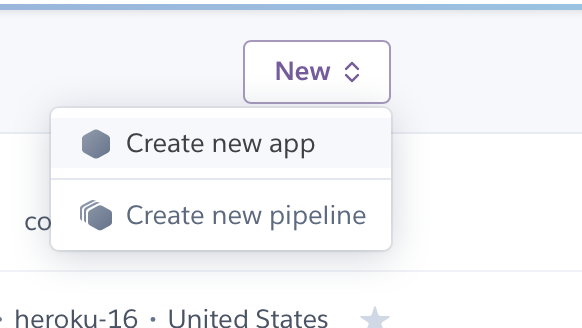
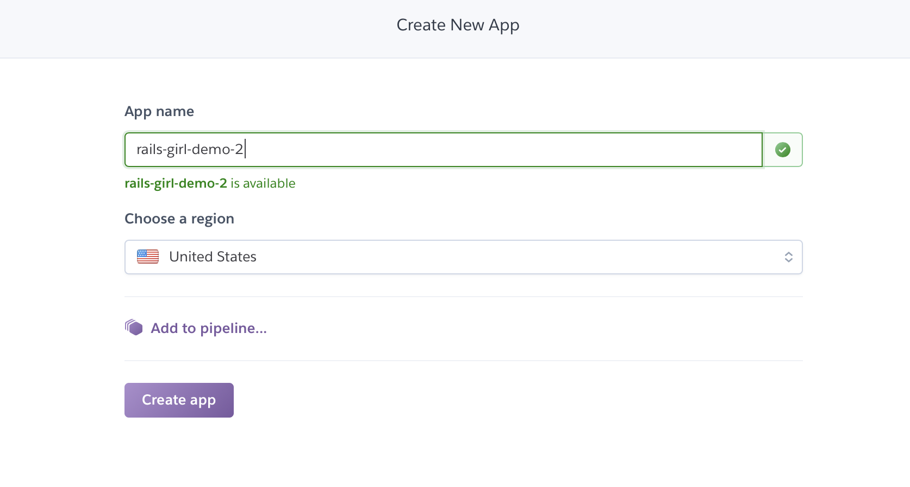

- Add Postgres Plugin

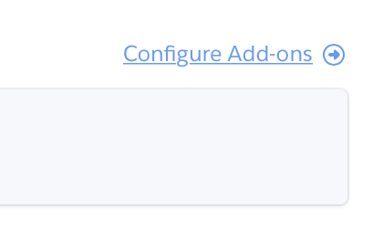
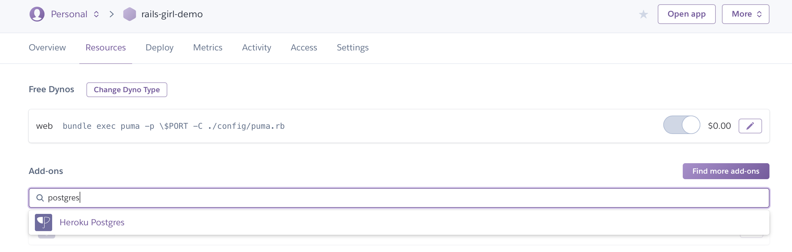
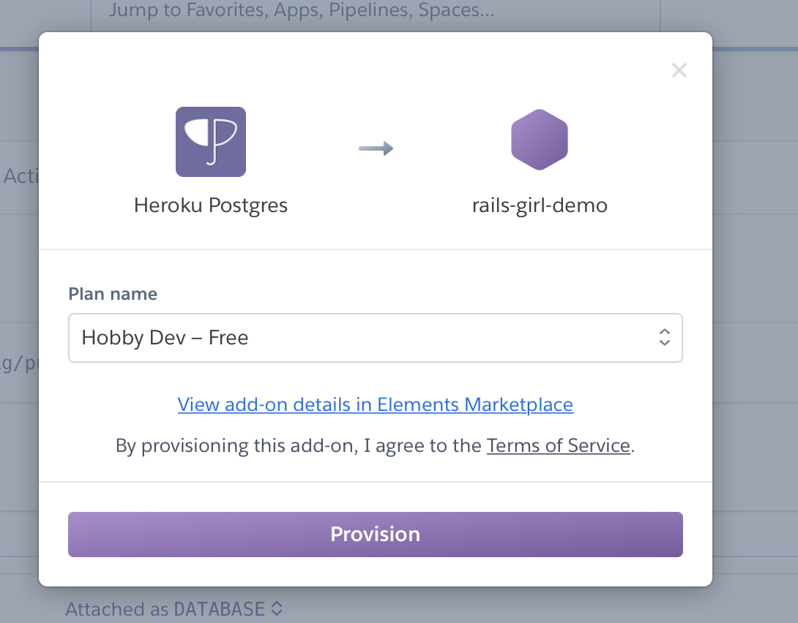
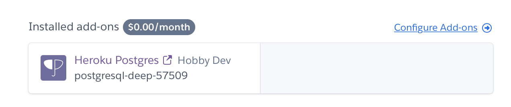

- Run `heroku login`
- Run `heroku container:login`
- Run `heroku container:push web --app <<APP NAME>>`
- Run `heroku container:release web --app <<APP NAME>>`

Click on "Open app", and enjoy

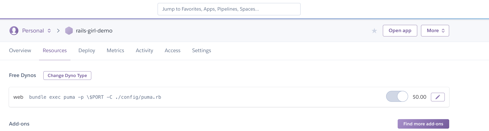

To re-deploy, please follow the following step:
- Run `heroku container:push web --app <<APP NAME>>`
- Run `heroku container:release web --app <<APP NAME>>`
</details>

<details><summary><h2>[Advanced] 6. Add to cart feature</h2></summary>
If we want to buy something, we must have a cart where we put the selected product. But, as you know, the cart has many productions and vice versa, a product may belong to any cart. This is a many-many relationship. So we must split it into one-many relationships. Do come, we need two tables more for this, that call Cart and CartItem.

- Create Cart and Cart Item model with following commands:
  ```
  rails generate model Cart
  rails generate model CartItem product:references cart:references quantity:integer
  ```

- Don't forget run below command to make sure your database apply all changing.
  ```
  rake db:migrate
  ```

- Open `app/models/cart.rb` and add following codes to create relationship with `cart_item`, `product`
  ```
  has_many :cart_items
  has_many :products, through: :cart_items
  ```

- We need a controller for `cart` and `cart_item`. Let's run:
  ```
  rails generate controller Carts show destroy
  rails generate controller CartItems create destroy
  ```

- Now, open `app/controllers/carts_controller.rb` and add following codes.
  Before editing,
  ```
  class CartsController < ApplicationController
    def show
    end

    def destroy
    end
  end
  ```
  After editing,
  ```
  class CartsController < ApplicationController
    def show
      @cart = @current_cart
    end

    def destroy
      @cart = @current_cart
      @cart.destroy
      session[:cart_id] = nil
      redirect_to root_path
    end
  end
  ```

- Do come, where is @current_cart? @current_cart stands for the current status of the cart. We need to set it when users access to the website. So all you need to do is updating file `app/controllers/application_controller.rb` as below:
  ```
  class ApplicationController < ActionController::Base
    before_action :set_cart

    private

    def set_cart
      if session[:cart_id]
        cart = Cart.find_by(id: session[:cart_id])
        cart.present? ? (@current_cart = cart) : (session[:cart_id] = nil)
      end
      return unless session[:cart_id].nil?

      @current_cart = Cart.create
      session[:cart_id] = @current_cart.id
    end
  end
  ```

- Next, we will update for `CartItemsController`. Please open and update file `app/controllers/cart_items_controller.rb` as below:
  ```
  class CartItemsController < ApplicationController
    def create
      chosen_product = Product.find(params[:product_id])
      add_items_to_cart(chosen_product)
      respond_to do |format|
        if @cart_item.save!
          format.html { redirect_back(fallback_location: @current_cart) }
          format.js
        else
          format.html { render :new, notice: 'Error adding product to basket!' }
        end
      end
    end

    def destroy
      @cart_item = CartItem.find(params[:id])
      @cart_item.destroy
      redirect_back(fallback_location: @current_cart)
    end

    private

    def cart_item_params
      params.require(:cart_item).permit(:quantity, :product_id, :cart_id)
    end

    def add_items_to_cart(chosen_product)
      # If cart already has this product then find the relevant cart_item
      # and iterate quantity otherwise create a new cart_item for this product
      if @current_cart.products.include?(chosen_product)
        # Find the cart_item with the chosen_product
        @cart_item = @current_cart.cart_items.find_by(product_id: chosen_product)
        # Iterate the cart_item's quantity by one
        @cart_item.quantity += 1
      else
        @cart_item = CartItem.new
        @cart_item.cart = @current_cart
        @cart_item.product = chosen_product
        # @cart_item.order = Order.first
        @cart_item.quantity = params[:quantity].to_i || 1
      end
    end
  end
  ```

- At present, we have done creating and updating model and controller of cart and cart_item. But, we need to check routes file, we will look like something wrong in here.
  ```
  get 'cart_items/create'
  get 'cart_items/destroy'
  get 'carts/show'
  get 'carts/destroy'
  ```
  3 lines above are incorrect, we must change it as follows:
  ```
  post 'cart_items', to: 'cart_items#create', as: 'cart_items'
  delete 'cart_items/:id', to: 'cart_items#destroy', as: 'cart_item'
  get 'carts/:id', to: 'carts#show', as: 'cart'
  delete 'carts/:id', to: 'carts#destroy'
  ```
  Or
  ```
  resources :carts, only: %i[show destroy]
  resources :cart_items, only: %i[create destroy]
  ```

  And, we don't need view for destroy action. Let's delete them.

- Now, access to `http://localhost:4000/carts/1` in order to see our result. We will see something like the following image.
  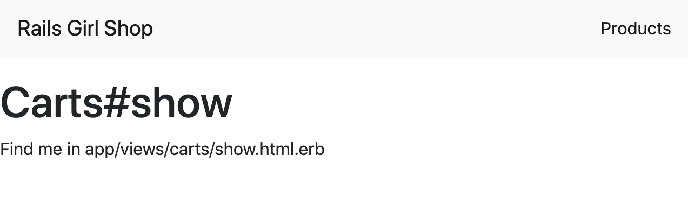

  As you see, we access directly, this isn't good. We should a menu for it. Open `app/views/layouts/application.html.erb` and update as below:
  ```
  <nav class="navbar navbar-expand-lg navbar-light bg-light">
    <a class="navbar-brand" href="<%= root_path %>">
      Rails Girl Shop
    </a>
    <ul class="navbar-nav ml-auto">
      <li class="nav-item active">
        <a class="nav-link" href="<%= products_path %>">Products</a>
      </li>
      <li class="nav-item">
        <a class="nav-link" href="<%= cart_path(@current_cart) %>">Cart[<%= @current_cart.cart_items.count %>]</a>
      </li>
    </ul>
  </nav>
  ```
  Then, open `app/assets/javascripts/carts.js` and add the following code
  ```
  $(document).ready(function(){
    setNavigation();

    $(".nav-item").click(function(e) {
      $(".active").removeClass('active');
      $(e.target).addClass('active');
    })
  });

  function setNavigation() {
    var path = window.location.pathname;
    path = path.replace(/\/$/, "");
    path = decodeURIComponent(path);

    if (path) {
      $(".nav-item a").each(function () {
        var href = $(this).attr('href');
        if (path.substring(0, href.length) == href) {
          $(this).closest('li').addClass('active');
        }
      })
    } else {
      $(".nav-item").first().addClass('active');
    }
  }
  ```

- Next step, we will update the product view to allow users to add it to cart. Add the following content below line  `<h5 class="product-price">` in `app/views/products/_product.html.erb`.
  ```
  <%= form_for(CartItem.new) do |f|%>
    <input type="hidden" name="product_id" value="<%= product.id %>">
    <input type="hidden" name="quantity" value="1">
    <%= submit_tag 'Add to cart' %>
  <% end %>
  ```
- Well done, let's run and check it. You will look like
  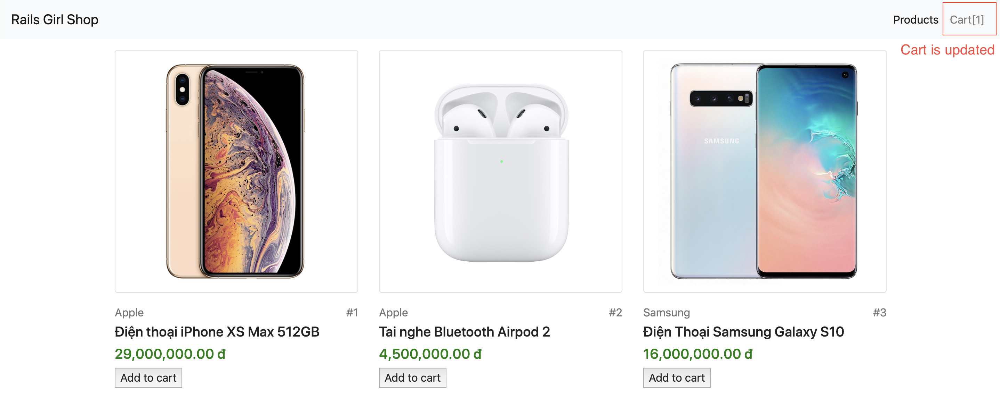
  
- But, if you view the current cart, you don't see any selected product. Why? Because you haven't updated the cart view yet. Let's open `app/views/carts/show.html.erb`, replace content with:
  ```
  <section class="ftco-section ftco-cart">
    <div class="container">
      <div class="row">
        <div class="col-md-12 ftco-animate">
          <div class="cart-list">

            <table class="table">
              <thead class="thead-dark">
                <tr>
                  <th scope="col">&nbsp;</th>
                  <th scope="col">&nbsp;</th>
                  <th scope="col">Product</th>
                  <th scope="col">Price</th>
                  <th scope="col">Quantity</th>
                  <th scope="col">Total</th>
                </tr>
              </thead>
              <tbody>
                <% @cart.cart_items.each do |item| %>
                  <%= render 'cart_item', item: item %>
                <% end %>
              </tbody>
            </table>

          </div>
        </div>
      </div>
    </div>
  </section>
  ```
  
  And, create new file `app/views/carts/_cart_item.html.erb` with the following content:
  ```
  <tr class="text-center">
    <td>
      <a href="<%= cart_item_path(item) %>" data-method="delete" data-confirm="Are you sure?" class="close" aria-label="Close">
        <span aria-hidden="true">&times;</span>
      </a>
    </td>
    <td class="image-prod">
      ">
    </td>
    <td class="product-name">
      <h3><%= item.product.name %></h3>
      <p><%= truncate(item.product.description, length: 150) %></p>
    </td>
    <td class="price">
      <%= number_to_currency(item.product.price, unit: 'đ', seperator: ',', format: "%n %u") %>
    </td>
    <td class="quantity">
      <div class="input-group mb-3">
        <input data-id="<%= item.id %>" type="text" name="quantity" class="quantity form-control input-number" value="<%= item.quantity %>" min="1" max="100">
      </div>
    </td>
    <td class="total" id="total-<%= item.id %>">
      <%= number_to_currency(item.quantity * item.product.price, unit: 'đ', seperator: ',', format: "%n %u") %>
    </td>
  </tr>
  ```

  We need also update `app/views/products/show.html.erb` as follows:
  ```
  <div class="product-detail container d-flex justify-content-around">
    "/>
    <div class="product-detail-info ml-3">
      <div class="d-flex justify-content-between">
        <div class="product-brand mb-1"><%= @product.brand %></div>
        <div class="product-id mb-1">#<%= @product.id %></div>
      </div>

      <h4 class="product-name"><a href="<%= product_path(@product) %>"><%= @product.name %></a></h5>
      <h5 class="product-price"><%= number_to_currency(@product.price, unit: 'đ', seperator: ',', format: "%n %u") %></h5>
      <p class="product-description"><%= simple_format(@product.description) %></p>
      <%= form_for(CartItem.new) do |f|%>
        <input type="hidden" name="product_id" value="<%= @product.id %>">
        <input type="hidden" name="quantity" value="1">
        <%= submit_tag 'Add to cart' %>
      <% end %>
    </div>
  </div>
  ```

  Don't forget to add style for cart, this makes our site look better. You could use some style below, just add it to `app/assets/stylesheets/carts.scss`.
  ```
  .table {
    min-width: 1000px !important;
    width: 100%;
    text-align: center;
  }
  .table th {
    font-weight: 500;
  }
  .table .thead-primary {
    background: black;
  }
  .table .thead-primary tr th {
    padding: 20px 10px;
    color: #fff !important;
    border: 1px solid transparent !important;
  }
  .table tbody tr td {
    text-align: center !important;
    vertical-align: middle;
    padding: 40px 10px;
    border: 1px solid transparent !important;
    border-bottom: 1px solid rgba(0, 0, 0, 0.05) !important;
  }
  .table tbody tr td.product-remove a {
    bordeR: 1px solid rgba(0, 0, 0, 0.1);
    padding: 5px 10px;
    color: #000000;
  }
  .table tbody tr td.product-remove a:hover {
    border: 1px solid #ffa45c;
    background: #ffa45c; 
  }
  .table tbody tr td.product-remove a:hover span {
    color: #fff;
  }
  .table tbody tr td.quantity {
    width: 10%;
  }
  .table tbody tr td.image-prod .img {
    display: block;
    width: 150px;
    // height: 150px;
    margin: 0 auto;
  }
  .table tbody tr td.product-name {
    width: 30%;
  }
  .table tbody tr td.product-name h3 {
    font-size: 14px;
    text-transform: uppercase;
    letter-spacing: 2px;
  }
  .table tbody tr td.total, .table tbody tr td.price {
    color: #000000;
  }
  ```
- At present, you can view your cart but you can't change product quantity. To do that, let's change `app/controllers/cart_items_controller.rb` as follows:
  ```
  class CartItemsController < ApplicationController
    before_action :set_cart_item, only: [:update_quantity]

    def create
      chosen_product = Product.find(params[:product_id])
      add_items_to_cart(chosen_product)
      respond_to do |format|
        if @cart_item.save!
          format.html { redirect_back(fallback_location: @current_cart) }
          format.js
        else
          format.html { render :new, notice: 'Error adding product to basket!' }
        end
      end
    end

    def destroy
      @cart_item = CartItem.find(params[:id])
      @cart_item.destroy
      redirect_back(fallback_location: @current_cart)
    end

    def update_quantity
      new_quantity = params[:quantity].to_i
      @cart_item.update(quantity: new_quantity) if new_quantity.present?
      total = @cart_item.product.price * @cart_item.quantity
      opts = {
        unit: 'đ',
        seperator: ',',
        format: '%n %u'
      }
      total = ActionController::Base.helpers.number_to_currency(total, opts)
      render json: { total: total }, status: 200
    end

    private

    def set_cart_item
      @cart_item = CartItem.find(params[:id])
    end

    def cart_item_params
      params.require(:cart_item).permit(:quantity, :product_id, :cart_id)
    end

    def add_items_to_cart(chosen_product)
      # If cart already has this product then find the relevant cart_item
      # and iterate quantity otherwise create a new cart_item for this product
      if @current_cart.products.include?(chosen_product)
        # Find the cart_item with the chosen_product
        @cart_item = @current_cart.cart_items.find_by(product_id: chosen_product)
        # Iterate the cart_item's quantity by one
        @cart_item.quantity += 1
      else
        @cart_item = CartItem.new
        @cart_item.cart = @current_cart
        @cart_item.product = chosen_product
        # @cart_item.order = Order.first
        @cart_item.quantity = params[:quantity].to_i || 1
      end
    end
  end
  ```
  We also update routes file as below:

  ```
  Rails.application.routes.draw do
    get 'products/index'
    get 'products/show'
    root 'products#index'
    resources :products, only: [:index, :show]
    resources :carts, only: %i[show destroy]
    resources :cart_items, only: %i[create destroy] do
      collection do
        patch '/update_quantity', action: :update_quantity  
      end
    end
  end
  ```
  Finally, you need to update `app/assets/javascripts/carts.js`:
  ```
  $(document).ready(function(){
    setNavigation();

    $(".nav-item").click(function(e) {
      $(".active").removeClass('active');
      $(e.target).addClass('active');
    })

    $("input.quantity").change(function(e) {
      var id = $(this).data("id");
      var new_quantity = $(this).val();
      $.ajax({
        url: '/cart_items/update_quantity',
        type: "PATCH",
        data: { id: id, quantity: new_quantity },
        dataType: "json",
        success: function(data) {
          $(`#total-${id}`).html(data.total);
        },
        error: function(request, error){
          alert("Request: " + JSON.stringify(request));
        }
      })
    })
  });

  function setNavigation() {
    var path = window.location.pathname;
    path = path.replace(/\/$/, "");
    path = decodeURIComponent(path);

    if (path) {
      $(".nav-item a").each(function () {
        var href = $(this).attr('href');
        if (path.substring(0, href.length) == href) {
          $(this).closest('li').addClass('active');
        }
      })
    } else {
      $(".nav-item").first().addClass('active');
    }
  }
  ```

- We have done, let's open the browser and check it.
</details>

<details><summary><h2>[Advanced] 7. Add authentication feature</h2></summary>
</details>

<details><summary><h2>[Advanced] 8. Build admin product management page</h2></summary>
</details>

<details><summary><h2>[Advanced] 9. Add checkout flow</h2></summary>
</details>
